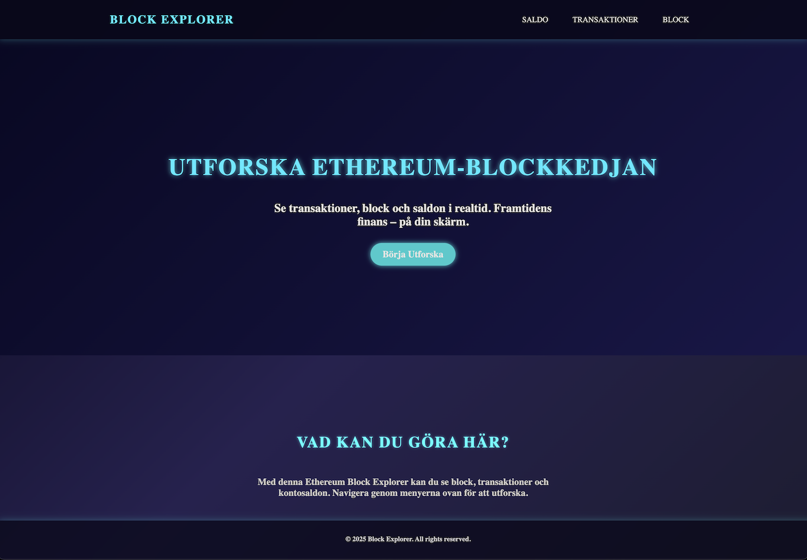
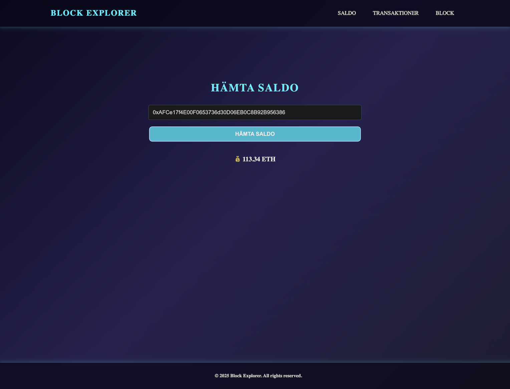
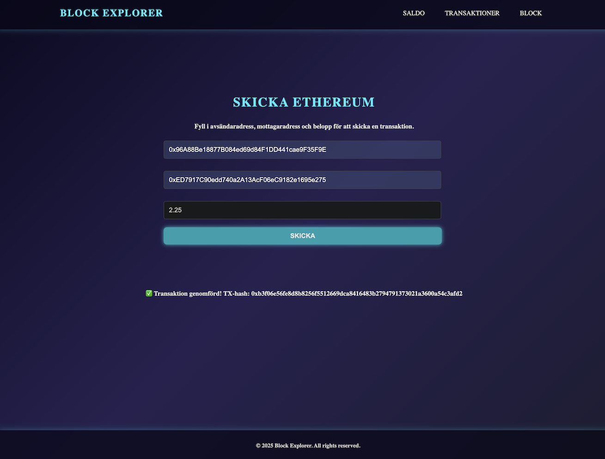
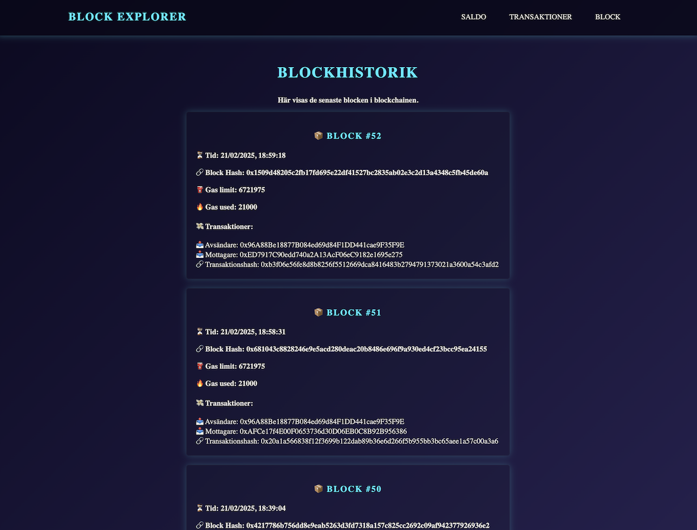

# 🚀 Block Explorer

Block Explorer är en **frontend-applikation** som låter dig interagera med en Ethereum-blockkedja.  
Applikationen gör det möjligt att:

✅ **Hämta saldo** för en Ethereum-adress  
✅ **Skicka transaktioner** mellan Ethereum-konton  
✅ **Visa de senaste blocken** i blockkedjan

Den använder **Ganache** som testnätverk och **ethers.js** för att interagera med Ethereum-blockkedjan. Projektet är uppbyggt med en **objektorienterad programmeringsstruktur (OOP)** för bättre modularitet och underhållbarhet.

---

## 🛠 Teknologier

- **JavaScript (ES6-moduler) & OOP** – För logik, struktur och funktionalitet
- **Ganache** – Lokal Ethereum-blockkedja för testning
- **ethers.js** – För interaktion med Ethereum-blockkedjan
- **HTML & CSS** – Frontend-design och layout
- **Node.js** – För hantering av paket
- **Vitest** – Enhetstester och testmiljö
- **Live Server** – För lokal utveckling

---

## 🔧 Installation & Användning

Följ dessa steg för att köra projektet lokalt:

### 1️⃣ Installera beroenden

```bash
npm install
```

### 2️⃣ Starta Ganache

- Öppna **Ganache** och skapa en ny workspace
- Ställ in RPC-servern till:

```bash
http://127.0.0.1:7545
```

### 3️⃣ Starta utvecklingsservern

Det finns två alternativ för att köra projektet lokalt:

#### Alternativ 1: Använd Live Server i VS Code

- Högerklicka på `index.html` → Välj **"Open with Live Server"**
- Navigera till:

```bash
http://127.0.0.1:5500/
```

_(kan variera beroende på inställningar)_

#### Alternativ 2: Starta en lokal server med http-server

Om du inte använder Live Server kan du starta en enkel server med http-server:

```bash
npx http-server .
```

- Navigera sedan till:

```bash
http://127.0.0.1:8080/
```

---

## 📝 Funktioner

### 🔹 Saldo

- Ange en Ethereum-adress och få dess aktuella saldo i Ether.

### 🔹 Skicka transaktioner

- Skicka ETH mellan olika konton i Ganache.

### 🔹 Visa blockkedjan

- Se de senaste blocken och dess transaktioner.

### 🔹 Automatiserade tester med Vitest

- Kör enhetstester för att säkerställa att applikationens DOM-funktioner fungerar korrekt.

---

## 🧪 Köra Tester

### 1️⃣ Konfigurera tester med Vitest

Tester är redan konfigurerade med **Vitest**. För att köra testerna:

```bash
npm test
```

### 2️⃣ Kör tester i watch mode

Kör tester automatiskt när du gör ändringar i koden:

```bash
npm run test:watch
```

### ✅ Vad som testas

- Funktioner för att skapa HTML-element (`createElement` och `createTextElement`) testas för att säkerställa korrekt struktur och innehåll.

---

## 👨‍💻 Utvecklare

📌 **Niklas Nilsson**

---

2025 Block Explorer – Ethereum Blockchain Viewer 🚀

## 📸 Screenshots

### 🏠 Start Page



### 💰 Balance Page



### 🔍 Transaction Page



### 📊 Block History


